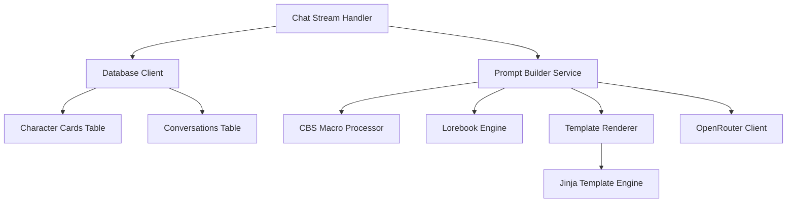

# Design Document

## Overview

This feature implements a dynamic prompt rendering system based on the Character Card V3 specification. The system will parse character cards, process lorebook entries, replace CBS macros, and render prompts using Jinja templates. This enhances the existing chat application by allowing rich character personalities, conditional context injection, and flexible prompt formatting.

The implementation will be modular and integrate seamlessly with the existing chat-stream handler and OpenRouter service.

## Architecture

### High-Level Flow

```
User Request → Chat Handler → Database (Load Character Card) → CBS Processor → 
Lorebook Matcher → Template Renderer → OpenRouter → Stream Response
```

### Component Diagram



## Components and Interfaces

### 1. Character Card Types (`src/models/character-card.ts`)

TypeScript interfaces matching the CCv3 specification. Character cards are stored in the database as JSON and loaded when needed:

```typescript
export interface CharacterCardV3 {
  spec: 'chara_card_v3';
  spec_version: '3.0';
  data: CharacterCardData;
}

export interface CharacterCardData {
  // Core fields
  name: string;
  description: string;
  tags: string[];
  creator: string;
  character_version: string;
  mes_example: string;
  extensions: Record<string, any>;
  system_prompt: string;
  post_history_instructions: string;
  first_mes: string;
  alternate_greetings: string[];
  personality: string;
  scenario: string;
  creator_notes: string;
  character_book?: Lorebook;
  
  // V3 additions
  assets?: Asset[];
  nickname?: string;
  creator_notes_multilingual?: Record<string, string>;
  source?: string[];
  group_only_greetings: string[];
  creation_date?: number;
  modification_date?: number;
}

export interface Asset {
  type: string;
  uri: string;
  name: string;
  ext: string;
}

export interface Lorebook {
  name?: string;
  description?: string;
  scan_depth?: number;
  token_budget?: number;
  recursive_scanning?: boolean;
  extensions: Record<string, any>;
  entries: LorebookEntry[];
}

export interface LorebookEntry {
  keys: string[];
  content: string;
  extensions: Record<string, any>;
  enabled: boolean;
  insertion_order: number;
  case_sensitive?: boolean;
  use_regex: boolean;
  constant?: boolean;
  
  // Optional fields
  name?: string;
  priority?: number;
  id?: number | string;
  comment?: string;
  selective?: boolean;
  secondary_keys?: string[];
  position?: 'before_char' | 'after_char';
}

export interface ParsedDecorators {
  depth?: number;
  role?: 'assistant' | 'system' | 'user';
  activate_only_after?: number;
  activate_only_every?: number;
  position?: string;
  scan_depth?: number;
  additional_keys?: string[][];
  exclude_keys?: string[][];
  activate?: boolean;
  dont_activate?: boolean;
}
```

### 2. CBS Macro Processor (`src/services/cbs-processor.ts`)

Handles replacement of curly-braced syntaxes:

```typescript
export interface CBSContext {
  charName: string;
  userName: string;
  conversationId?: string;
}

export class CBSProcessor {
  /**
   * Process all CBS macros in text
   */
  process(text: string, context: CBSContext): string;
  
  /**
   * Extract hidden keys for lorebook scanning
   */
  extractHiddenKeys(text: string): string[];
  
  private replaceChar(text: string, charName: string): string;
  private replaceUser(text: string, userName: string): string;
  private replaceRandom(text: string): string;
  private replacePick(text: string, seed: string): string;
  private replaceRoll(text: string): string;
  private replaceReverse(text: string): string;
  private removeComments(text: string): string;
  private removeHiddenKeys(text: string): string;
}
```

### 3. Lorebook Engine (`src/services/lorebook-engine.ts`)

Matches and processes lorebook entries:

```typescript
export interface LorebookContext {
  messages: Message[];
  characterCard: CharacterCardData;
  scanText: string;
  assistantMessageCount: number;
}

export interface MatchedEntry {
  entry: LorebookEntry;
  decorators: ParsedDecorators;
  processedContent: string;
}

export class LorebookEngine {
  /**
   * Find all matching lorebook entries
   */
  findMatches(
    lorebook: Lorebook,
    context: LorebookContext
  ): MatchedEntry[];
  
  /**
   * Parse decorators from entry content
   */
  private parseDecorators(content: string): {
    decorators: ParsedDecorators;
    cleanContent: string;
  };
  
  /**
   * Check if entry keys match scan text
   */
  private matchesKeys(
    entry: LorebookEntry,
    scanText: string,
    scanDepth?: number
  ): boolean;
  
  /**
   * Apply decorator conditions
   */
  private meetsDecoratorConditions(
    decorators: ParsedDecorators,
    context: LorebookContext
  ): boolean;
  
  /**
   * Sort entries by insertion order and priority
   */
  private sortEntries(entries: MatchedEntry[]): MatchedEntry[];
}
```

### 4. Template Renderer (`src/services/template-renderer.ts`)

Renders prompts using Jinja templates:

```typescript
import { Template } from '@huggingface/jinja';

export interface TemplateContext {
  character: CharacterCardData;
  messages: Message[];
  userName: string;
  lorebookEntries: MatchedEntry[];
  systemPrompt?: string;
}

export class TemplateRenderer {
  private templates: Map<string, Template>;
  
  constructor();
  
  /**
   * Render a template with context
   */
  render(templateName: string, context: TemplateContext): string;
  
  /**
   * Register a custom template
   */
  registerTemplate(name: string, templateString: string): void;
  
  /**
   * Get default templates (ChatML, Alpaca, Llama)
   */
  private initializeDefaultTemplates(): void;
}
```

### 5. Prompt Builder Service (`src/services/prompt-builder.ts`)

Orchestrates the entire prompt construction process:

```typescript
export interface CompiledContext {
  characterName: string;
  characterNickname?: string;
  systemPrompt?: string;
  description: string;
  personality?: string;
  scenario?: string;
  greeting: string;
  constantLorebookEntries: MatchedEntry[]; // Entries with constant=true
}

export interface PromptBuildOptions {
  compiledContext?: CompiledContext; // Pre-compiled static context
  characterCard?: CharacterCardV3; // Only needed if compiledContext not available
  messages: Message[];
  userPrompt: string;
  userName?: string;
  templateName?: string;
}

export class PromptBuilder {
  private cbsProcessor: CBSProcessor;
  private lorebookEngine: LorebookEngine;
  private templateRenderer: TemplateRenderer;
  
  constructor();
  
  /**
   * Compile static character context (called once per conversation)
   */
  async compileStaticContext(
    characterCard: CharacterCardV3,
    userName: string,
    greetingIndex?: number
  ): Promise<CompiledContext>;
  
  /**
   * Build complete prompt for AI model using compiled context
   */
  async buildPrompt(options: PromptBuildOptions): Promise<ChatCompletionMessageParam[]>;
  
  /**
   * Process dynamic content (lorebook matching, current messages)
   */
  private processDynamicContent(
    messages: Message[],
    userPrompt: string,
    lorebook?: Lorebook,
    compiledContext?: CompiledContext
  ): MatchedEntry[];
  
  /**
   * Get greeting message (first_mes or alternate)
   */
  private getGreeting(
    card: CharacterCardData,
    index?: number
  ): string;
}
```

### 6. Database Schema Extensions

Add character card storage to existing schema:

```typescript
// New table in src/db/schema.ts
export const characterCards = sqliteTable(
  'character_cards',
  {
    id: text('id').primaryKey(),
    name: text('name').notNull(),
    data: text('data').notNull(), // JSON string of CharacterCardV3
    createdAt: text('created_at').notNull(),
    modifiedAt: text('modified_at').notNull(),
  },
  (table) => ({
    nameIdx: index('idx_card_name').on(table.name),
  })
);

// Add character_card_id and compiled_context to conversations table
export const conversations = sqliteTable(
  'conversations',
  {
    // ... existing fields ...
    characterCardId: text('character_card_id')
      .references(() => characterCards.id, { onDelete: 'set null' }),
    compiledContext: text('compiled_context'), // Pre-compiled static character context (JSON)
  }
);
```

## Data Models

### Character Card Storage

Character cards are stored as JSON in the database. When retrieved, they are parsed into TypeScript objects for type safety.

### Message Flow

1. User sends message (conversation already has character card ID)
2. System loads character card from database (if not cached)
3. **Static content** (character description, personality, system prompt) is pre-compiled once per conversation
4. **Dynamic content** (lorebook entries, current message) is processed for each message
5. Prompt builder combines static + dynamic content
6. Template renderer creates final prompt
7. Prompt sent to OpenRouter
8. Response streamed back to user

**Optimization**: Character cards are pre-stored in the database. Static character information (description, personality, system_prompt, etc.) is processed once when a conversation is created and cached. Only dynamic elements (lorebook matching, current messages, CBS macros in messages) are processed per-message.

### Lorebook Matching Algorithm

```
For each lorebook entry:
  1. Check if enabled = true
  2. If constant = true, mark as matched
  3. Otherwise, check keys against scan text
  4. Parse decorators from content
  5. Check decorator conditions (depth, activation rules)
  6. If all conditions met, add to matched list
  
Sort matched entries by:
  1. Priority (if present)
  2. Insertion order
  
Apply token budget limits if specified
```

## Correctness Properties

*A property is a characteristic or behavior that should hold true across all valid executions of a system-essentially, a formal statement about what the system should do. Properties serve as the bridge between human-readable specifications and machine-verifiable correctness guarantees.*


### Property 1: Character card validation accepts valid cards
*For any* character card object that conforms to the CCv3 schema, storing and retrieving it from the database should preserve the card structure without errors.
**Validates: Requirements 1.1**

### Property 2: Required field extraction preserves values
*For any* valid character card with required fields (name, description, first_mes), extracting these fields should return values that match the original card data.
**Validates: Requirements 1.2**

### Property 3: Optional fields appear when present
*For any* character card with optional fields (personality, scenario, system_prompt) present, the rendered prompt should contain those field values.
**Validates: Requirements 1.3**

### Property 4: Nickname used for {{char}} when present
*For any* character card with a nickname field and any text containing {{char}}, the macro should be replaced with the nickname value.
**Validates: Requirements 1.4**

### Property 5: Name used for {{char}} when nickname absent
*For any* character card without a nickname field and any text containing {{char}}, the macro should be replaced with the name value.
**Validates: Requirements 1.5**

### Property 6: {{user}} macro replacement
*For any* text containing {{user}} and any user display name, the macro should be replaced with that display name.
**Validates: Requirements 2.2**

### Property 7: {{random}} selects from list
*For any* text containing {{random:A,B,C,...}} with N values, the replacement should be one of those N values.
**Validates: Requirements 2.3**

### Property 8: {{pick}} is idempotent
*For any* text containing {{pick:A,B,C,...}}, processing the same text multiple times should always produce the same replacement value.
**Validates: Requirements 2.4**

### Property 9: {{roll:N}} produces valid range
*For any* positive integer N in {{roll:N}} or {{roll:dN}}, the replacement should be an integer in the range [1, N].
**Validates: Requirements 2.5**

### Property 10: Comments are removed
*For any* text containing {{// comment}}, the comment syntax should not appear in the processed output.
**Validates: Requirements 2.6**

### Property 11: Hidden keys removed from output
*For any* text containing {{hidden_key:text}}, the hidden key syntax should not appear in the processed output.
**Validates: Requirements 2.7**

### Property 12: {{reverse}} reverses text
*For any* text T in {{reverse:T}}, the replacement should be the string T with characters in reverse order, and reversing twice should return the original.
**Validates: Requirements 2.8**

### Property 13: Matching lorebook entries included
*For any* lorebook entry with keys that match the chat context and enabled=true, the entry's content should appear in the final prompt.
**Validates: Requirements 3.1**

### Property 14: Disabled entries excluded
*For any* lorebook entry with enabled=false, the entry's content should not appear in the final prompt regardless of key matches.
**Validates: Requirements 3.2**

### Property 15: Constant entries always included
*For any* lorebook entry with constant=true and enabled=true, the entry's content should appear in the final prompt regardless of key matches.
**Validates: Requirements 3.3**

### Property 16: Regex matching works correctly
*For any* lorebook entry with use_regex=true and valid regex patterns in keys, matching should follow regex rules rather than literal string matching.
**Validates: Requirements 3.4**

### Property 17: Case sensitivity respected
*For any* lorebook entry with case_sensitive=true, key matching should distinguish between different cases (e.g., "Hello" ≠ "hello").
**Validates: Requirements 3.5**

### Property 18: Entries ordered by insertion_order
*For any* set of matching lorebook entries, the entries should appear in the output sorted by their insertion_order field values.
**Validates: Requirements 3.6**

### Property 19: @@depth positions content correctly
*For any* lorebook entry with @@depth N and any message history with at least N messages, the entry content should be inserted at the Nth position from the most recent message.
**Validates: Requirements 4.1**

### Property 20: @@role formats messages correctly
*For any* lorebook entry with @@role R where R is "assistant", "system", or "user", the output message should have role=R.
**Validates: Requirements 4.2, 4.3, 4.4**

### Property 21: @@activate_only_after respects message count
*For any* lorebook entry with @@activate_only_after N, the entry should not appear when assistant message count < N, and should be eligible to appear when count >= N.
**Validates: Requirements 4.5**

### Property 22: @@position after_desc places content correctly
*For any* lorebook entry with @@position after_desc, the entry content should appear after the character description in the output.
**Validates: Requirements 4.6**

### Property 23: @@scan_depth limits scanning
*For any* lorebook entry with @@scan_depth N, keys appearing only in messages older than the N most recent messages should not trigger a match.
**Validates: Requirements 4.7**

### Property 24: Template variables include character data
*For any* template that references character card fields and any character card, the template should have access to all character fields during rendering.
**Validates: Requirements 5.2**

### Property 25: Template variables include message history
*For any* template that references conversation messages and any message history, the template should have access to all messages during rendering.
**Validates: Requirements 5.3**

### Property 26: Template errors return descriptive messages
*For any* template rendering error (invalid syntax, missing variables, etc.), the system should return an error message rather than throwing silently.
**Validates: Requirements 5.5**

### Property 27: Template applies data correctly
*For any* template and any character/history data, rendering the template should produce output that includes the provided data.
**Validates: Requirements 6.3**

### Property 28: Greeting selection by index
*For any* character card with N greetings (first_mes + alternate_greetings), selecting index i where 0 <= i < N should return the ith greeting.
**Validates: Requirements 6.4**

### Property 29: Conversation history included in prompt
*For any* non-empty message history, the rendered prompt should include those messages.
**Validates: Requirements 7.3**

### Property 30: CBS processed before templates
*For any* text containing CBS macros used within template syntax, the macros should be replaced before template rendering occurs.
**Validates: Requirements 7.4**

### Property 31: Lorebook content positioned correctly
*For any* matched lorebook entries with position decorators, the content should appear at the positions specified by the decorators.
**Validates: Requirements 7.5**

### Property 32: Character card storage round-trip
*For any* character card, storing it to the database and then retrieving it should produce an equivalent character card object.
**Validates: Requirements 8.1, 8.2**

### Property 33: Modification timestamp updates
*For any* character card update operation, the modification timestamp should be greater than or equal to the creation timestamp.
**Validates: Requirements 8.3**

## Error Handling

### Validation Errors

- **Invalid Character Card**: Return error with specific validation failures
- **Invalid CBS Syntax**: Log warning and leave macro unchanged
- **Invalid Regex in Lorebook**: Skip entry and log warning
- **Invalid Decorator Syntax**: Ignore decorator and log warning

### Template Errors

- **Template Not Found**: Fall back to default template
- **Template Rendering Error**: Return error with Jinja error message
- **Missing Template Variables**: Use empty string or default value

### Database Errors

- **Character Card Not Found**: Return null, let caller handle
- **Storage Failure**: Throw error to be caught by handler
- **Invalid JSON**: Return error during parsing

## Testing Strategy

### Unit Testing

Unit tests will cover:
- CBS macro replacement functions (each macro type)
- Decorator parsing logic
- Lorebook key matching (literal and regex)
- Template variable preparation
- Character card validation

### Property-Based Testing

We will use **fast-check** (JavaScript/TypeScript property-based testing library) to implement the correctness properties defined above.

**Configuration**:
- Minimum 100 iterations per property test
- Custom generators for character cards, lorebook entries, messages
- Shrinking enabled to find minimal failing cases

**Key Generators**:
- `arbitraryCharacterCard()`: Generates valid CCv3 character cards
- `arbitraryLorebookEntry()`: Generates lorebook entries with various configurations
- `arbitraryMessageHistory()`: Generates conversation message arrays
- `arbitraryCBSText()`: Generates text with various CBS macros

**Property Test Organization**:
- Each property test must reference its correctness property using the format: `**Feature: character-card-prompt-rendering, Property N: [property text]**`
- Tests grouped by component (CBS processor, lorebook engine, template renderer)
- Integration tests for full prompt building pipeline

### Integration Testing

- End-to-end prompt building with real character cards
- Database storage and retrieval
- Integration with chat-stream handler
- Template rendering with complex scenarios

## Performance Considerations

### Optimization Strategies

1. **Static Context Pre-compilation**: Process character card static fields (description, personality, system_prompt, greeting) once when conversation is created, store in `compiled_context` field
2. **Constant Lorebook Entries**: Pre-process lorebook entries with `constant=true` during static compilation
3. **Dynamic Processing Only**: For each message, only process:
   - Lorebook entries that need key matching
   - CBS macros in current user message
   - Current conversation history
4. **Lorebook Matching**: Cache regex compilation for entries with use_regex=true
5. **Template Rendering**: Compile templates once and reuse
6. **CBS Processing**: Use single-pass regex replacement where possible
7. **Database**: Index character_card_id in conversations table

### Performance Impact

- **First message**: ~50-100ms (includes static compilation)
- **Subsequent messages**: ~10-20ms (only dynamic processing)
- **Memory**: ~5-10KB per compiled context (cached in database)

### Scalability Limits

- Maximum lorebook entries per card: 1000 (soft limit)
- Maximum character card size: 1MB JSON
- Template rendering timeout: 5 seconds
- Lorebook scan depth: Limited to last 100 messages by default

## Security Considerations

1. **Template Injection**: Jinja templates from user input must be sanitized
2. **Regex DoS**: Limit regex complexity in lorebook entries
3. **JSON Parsing**: Validate character card JSON size before parsing
4. **Database Storage**: Sanitize character card data before storage

## Future Enhancements

1. **Asset Support**: Handle embedded assets (images, audio) from CHARX files
2. **Advanced Decorators**: Support more CCv3 decorators (@@instruct_depth, @@reverse_depth, etc.)
3. **Template Marketplace**: Allow users to share custom templates
4. **Lorebook Optimization**: Implement token budget enforcement
5. **Multi-character Support**: Handle group chats with multiple character cards
