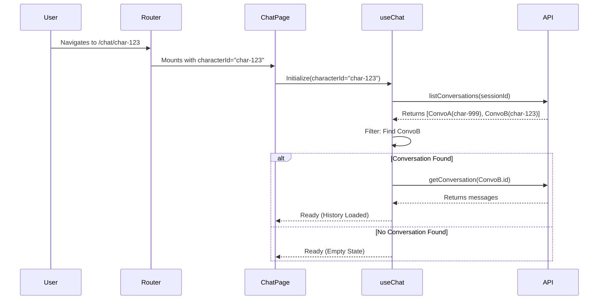

# Technical Design: Multi-Character Session Management System

## 1. Overview
This document outlines the technical approach to transform the current single-session chat application into a multi-character session management system. The goal is to mimic the user flow of platforms like Character.ai, where users can browse characters on a home page and maintain separate chat histories for each character.

## 2. Architecture Changes

### 2.1 Routing Strategy
We will introduce **Client-Side Routing** using `react-router-dom` to manage application state via URLs.

*   **Current**: Single Page Application (SPA) with conditional rendering.
*   **New**:
    *   `/` (Home): Displays a grid of available characters.
    *   `/chat/:characterId`: Displays the chat interface for a specific character.

### 2.2 State Management (Session Isolation)
The core challenge is isolating chat history per character. Currently, the backend supports `character_card_id` in the `Conversation` model, but the frontend simply loads the "most recent" conversation regardless of character.

**New Logic in `useChat` Hook:**
1.  **Input**: Accept `characterId` as a required parameter.
2.  **Initialization**:
    *   Fetch all conversations for the current `sessionId`.
    *   **Filter** the list client-side to find conversations where `conversation.character_card_id === characterId`.
    *   **Sort** by `updated_at` descending.
    *   **Load**: If a match is found, load that conversation's history.
    *   **Create**: If no match is found, initialize an empty state (ready to create a new conversation on the first message).

## 3. Implementation Plan

### 3.1 Dependencies
*   Add `react-router-dom` (v6+).

### 3.2 File Structure Changes
```text
public/src/
├── App.tsx              # Refactored to be the Router Provider
├── main.tsx             # Entry point (unchanged)
├── pages/               # [NEW] Page components
│   ├── Home.tsx         # Character grid display
│   └── ChatPage.tsx     # Chat interface wrapper
├── components/
│   ├── CharacterCard.tsx # [NEW] Individual card component for Home
│   ├── Layout.tsx       # [OPTIONAL] Common layout (header, etc.)
│   └── ... (Existing components: ChatDisplay, ChatInputForm)
└── hooks/
    └── useChat.ts       # Refactored for character-specific logic
```

### 3.3 Component Interfaces

#### `Home.tsx`
*   **Responsibility**: Fetch list of characters, render grid.
*   **Behavior**: Clicking a card navigates to `/chat/{id}`.
*   **State**: `cards` (list), `loading`, `error`.

#### `ChatPage.tsx`
*   **Responsibility**: Read `characterId` from URL params, initialize `useChat`.
*   **Render**:
    *   Header (Back button, Character Name, New Chat button).
    *   `ChatDisplay`.
    *   `ChatInputForm`.

### 3.4 Data Flow Diagram



## 4. Step-by-Step Implementation Guide

### Step 1: Install Dependencies
```bash
npm install react-router-dom
```

### Step 2: Create Page Components
1.  **`public/src/pages/Home.tsx`**:
    *   Copy logic from `CharacterCardSelector` but change the render to a grid.
    *   Use `Link` from `react-router-dom` to wrap cards.
2.  **`public/src/pages/ChatPage.tsx`**:
    *   Use `useParams` to get `characterId`.
    *   Render `ChatDisplay` and `ChatInputForm`.

### Step 3: Refactor `useChat.ts`
*   Modify signature: `export function useChat(activeCharacterId?: string)`
*   Update `loadHistory` effect:
    ```typescript
    // Pseudo-code
    const relevantConvo = allConversations.find(c => c.character_card_id === activeCharacterId);
    if (relevantConvo) {
        loadConversation(relevantConvo.id);
    } else {
        resetState(); // Ready for new conversation
    }
    ```
*   Update `sendMessage`: Ensure `characterCardId` is passed in the API request.

### Step 4: Update `App.tsx`
*   Replace current content with `BrowserRouter`, `Routes`, and `Route` definitions.

### Step 5: Cleanup
*   Remove `CharacterCardSelector.tsx` (if logic is fully moved to Home).
*   Update styles for the new page layout.

## 5. Future Considerations
*   **Pagination**: If conversation history becomes long, implement pagination in `useChat`.
*   **Context Window**: Ensure the backend correctly handles context compilation for the specific character.